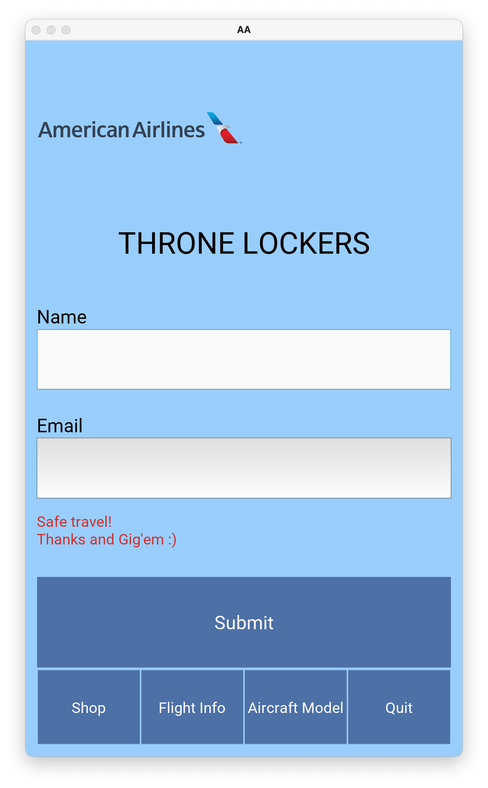

# THRONE-LOCKER
2021 TAMUhack

### Inspiration

We were inspired by our own airport experience and improved upon that. We usually arrived much earlier than the actual departure time, so we would wander around the airport for shopping or simply walking around. However, we want to make our product as efficient as possible by considering the group of people who would use them the most. We came up with the idea of the Business group as they have a short one-day trip, for example. Our locker would be the best place for them to secure their items at the airport. 

### What it does

Our project was designed to provide passengers a convenient place to store their items in the airport. Our locker is suitable for both short and long trips for the passengers. After submitting personal information, passengers will store their items in the locker and check them out later. Additionally, we also offer several supplemental business items that are necessary for people during a business trip. Our locker is open to all groups, not necessarily only the Business group. We used the Business group as an example. 

### How we built it

At the front, there is a user interaction interface on mobile phones where the system will automatically reserve a box for the users, or they can check out their items by selecting another button on the screen. The design of the box was based on Raspberry Pi 4, Arduino Uno, ultrasonic sensor, MPU6050, servo motor, passive buzzer, and two RGB LEDs. When the box is open, the buzzer will click for a few seconds, and the pink LED will stay on. Assisting by the ultrasonic sensor, which detects whether if there is anything inside the box, another LED will shine in red if the box has been occupied, or it will light in green when the box is available. The servo motor will lock or unlock the box based on the information read from the user interface. 

### Challenges we ran into

The most challenging part in the software development was to solve the issue that "screen switch does not run on a button click". We could not access the root management while setting up the "on-click" function on any "button" modules. Our solution was to read the Kivy Source Library documentation and earn some experience by reviewing the examples on the official web page. Other than that, we cloned some Kivy projects on GitHub and learned how others developed their applications based on Kivy. From a hardware perspective, we have faced problems in file transmission from Arduino to Raspberry Pi and uploading the file in Raspberry Pi to the server, which connects to the user interface. We spent a long time figuring out how to communicate between Arduino and Raspberry Pi and finally decided to apply the I2C protocol. 

### Accomplishments that we're proud of

With 24 hours, our group was able to design and create a project that involves both hardware and software and the data transmission between the modules. We believe most of the airports can implement our product in real-life with low cost and high usage. In particular, the style of our user interface matches the theme color of American Airlines. 

### How to use our application

Clone the repositories through the Github link, open up a terminal and type the command "python main.py" to execute the python file. The Github link will be available throughout the website. After successful download process, users will be able to view a log in page, with additional pages for shopping, checking for flight information and Aircraft Model.

### Screenshots / pics of our project

